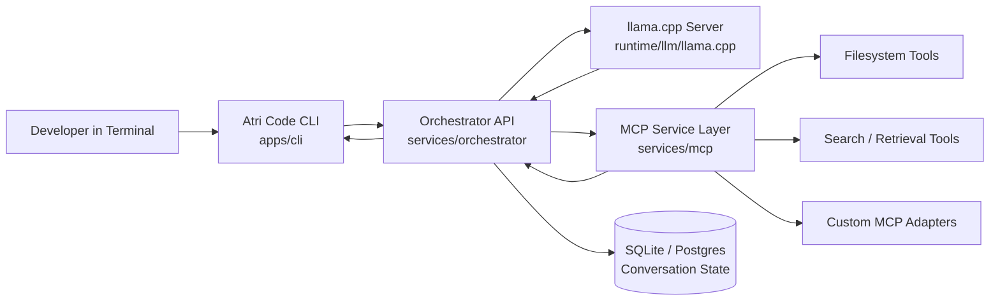

# Atri Code (CLI Branch)

This branch is the production CLI experience of Atri Code: a local-first agent system powered by llama.cpp, orchestrator policy/control loops, and MCP tool calling, delivered through a terminal-native interface.

## What This Project Is

Atri Code is an on-device agent architecture for private, controllable AI workflows.

Design goals:
- Keep LLM inference local with llama.cpp
- Execute tools through explicit MCP routes
- Provide auditable agent/tool interactions
- Offer a single-command bootstrap for reproducible setup

## CLI Branch Scope

This `master` branch is optimized for terminal-first usage.

Primary entrypoint:
- `apps/cli` (interactive and print-mode command-line client)

Runtime services:
- `runtime/llm/llama.cpp` (local model inference)
- `services/orchestrator` (agent loop, policies, turn lifecycle, persistence)
- `services/mcp` (tool execution layer)

## Technology Stack

- Inference runtime: llama.cpp
- Orchestration API: Python + FastAPI/Uvicorn
- Tool protocol: MCP (FastMCP)
- CLI client: Python (`apps/cli/atri_cli`)
- Build/bootstrap: Bash/PowerShell + Python + CMake
- Persistence: SQLite local state by default

## Model Runtime

Atri Code runs a local GGUF instruct model through `llama.cpp`.

Primary model:
- Model: Gemma 4 E2B Instruct
- Format: GGUF
- Quantization: Q4_K_M
- Local file: `models/gemma-4-e2b-it-Q4_K_M.gguf`
- Approximate model size: 3.1 GB download
- Model type: text-only instruct model

Runtime behavior:
- The CLI installer downloads the model automatically from Hugging Face if it is missing
- `llama.cpp` exposes the model through the OpenAI-compatible API on `http://127.0.0.1:8000/v1`
- The orchestrator manages prompt policy, tool calls, and turn state around the model
- The default model identifier exposed to the orchestrator is `local-model`

Resource expectations:
- Quickstart recommends at least 4 GB of available RAM for local use
- Disk usage is roughly 5 GB once the model cache and runtime files are included
- The bootstrap script builds `llama-server` and `llama-cli`, then selects a CPU or CUDA build based on whether NVIDIA tooling is available

## How the CLI Runtime Works

1. User prompt enters through `atri-cli`.
2. CLI sends request to orchestrator (`/chat` or `/chat/stream`).
3. Orchestrator asks llama.cpp for reasoning/action output.
4. If tool calls are required, orchestrator dispatches to MCP.
5. MCP executes tools and returns structured results.
6. Orchestrator loops model + tool outputs until final answer.
7. CLI renders response, timeline, and session metadata.

The model is not a standalone endpoint in this setup. The CLI uses the orchestrator as the control layer, and the orchestrator decides when to ask the model for a response versus when to call tools and feed results back into the model.

## CLI Architecture Diagram



## MCP and Tool Calls

Tool execution path:
- Model emits a tool request.
- Orchestrator validates policy + permissions.
- Request is routed to MCP tool endpoint(s).
- Tool outputs are normalized and appended to turn context.
- Final answer is returned only after tool-grounded completion.

CLI capabilities include session operations, streaming, permission mode controls, and MCP tool/service inspection.

## One-Command Install and Run

Linux/macOS (CLI mode):

```bash
curl -fsSL https://raw.githubusercontent.com/ToniBirat7/Agentic_AI/master/install.sh | bash
tarbar
```

Windows PowerShell (CLI mode):

```powershell
powershell -ExecutionPolicy Bypass -Command "iwr https://raw.githubusercontent.com/ToniBirat7/Agentic_AI/master/scripts/cli_up.ps1 -UseBasicParsing | iex"
```

Compatibility wrapper (installs and launches in one command on Linux/macOS):

```bash
curl -fsSL https://raw.githubusercontent.com/ToniBirat7/Agentic_AI/master/scripts/cli_up.sh | bash
```

Fresh full local runtime bootstrap (llama + orchestrator, CLI mode):

```bash
curl -fsSL https://raw.githubusercontent.com/ToniBirat7/Agentic_AI/master/scripts/local_up.sh | bash -s -- --mode cli
```

The installer creates a `tarbar` launcher and attempts to create a `claude` alias when that command name is not already claimed by another tool.

## Local Development

From an existing local clone on this branch:

```bash
make install
make cli-up
```

Run CLI module directly:

```bash
cd apps/cli
python -m atri_cli.main
```

Installed launcher:

```bash
atri-cli --help
atri-cli doctor
```

Credential safety note:
- Use environment variables or local `.env` files for keys/secrets.
- Keep placeholder defaults like `__SET_ME__` until you inject real values locally.

Compatibility note:
- `tarbar` remains available as a compatibility alias for one release cycle.

Print mode example:

```bash
python -m atri_cli.main -p "Explain this repository"
```

## Runtime Ports (Default)

- CLI client: local terminal process
- Orchestrator API: `http://127.0.0.1:8001`
- llama.cpp API: `http://127.0.0.1:8000`

## Prerequisites

- Git
- Python 3.10+
- Node.js 20+
- npm
- CMake
- Optional CUDA toolchain (`nvidia-smi`, `nvcc`) for GPU acceleration

## Production Notes

- Branch-aware bootstrap scripts standardize installation and startup.
- Runtime state defaults to durable local persistence.
- Post-start pruning and cache cleanup keep deployment footprints lean.
- Large model binaries remain local and out of version control.

## Production File Policy

- Keep only production code, required docs, and deployment assets in git.
- Keep runtime artifacts local only: databases, logs, cache directories, and model binaries.
- Use `make clean` (or remove local runtime directories) before packaging or publishing snapshots.
- Avoid committing ad-hoc planning notes or generated reports at repository root.

## Branch Strategy

- `master` (this branch): CLI-first workflow.
- `web`: browser-first workflow.

If you need the Web UX, run installers from the `web` branch.
