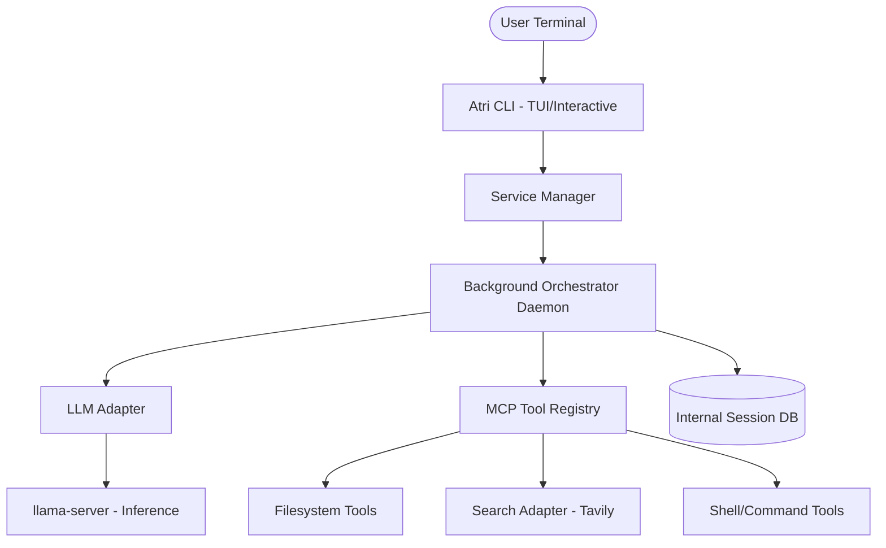

# Atri Code

Atri Code is a high-performance, local-first agentic coding infrastructure. It combines state-of-the-art LLM inference through `llama.cpp` with a robust Model Context Protocol (MCP) orchestration layer to provide a secure, private, and extremely fast agentic coding experience directly in your terminal.

## Core Architecture

Atri Code is designed as a decoupled, multi-service system to ensure sub-second responsiveness and reliable tool execution.



### 1. Orchestration Layer (The Brain)
The core reasoning engine implements an advanced **multi-turn ReAct loop**. It manages conversation state, persists session history in a hardened SQLite database, and handles the "Chain of Thought" required to solve complex coding tasks. 
- **Deterministic Fallbacks**: Integrated heuristics to handle ambiguous LLM outputs.
- **State Persistence**: Conversations are stored in `runtime/state/.internal.db` with strict `0700` permissions.

### 2. Inference Engine (The Muscle)
Powered by a customized build of `llama.cpp`, Atri Code leverages your local hardware (NVIDIA GPUs, Apple Silicon, or high-core CPUs) to run quantized GGUF models. 
- **Default Model**: Gemma 4 (Q4_K_M) - Optimized for coding and reasoning.
- **Context Management**: 16K context window with proactive snippet truncation to maintain high throughput.

### 3. Model Context Protocol - MCP (The Senses)
Atri Code follows the Model Context Protocol to interface with your local environment. This abstraction layer ensures that the agent can interact with your filesystem and the web through a unified, secure interface.
- **Proactive Web Search**: Grounding agent knowledge with real-time data via Tavily integration.
- **Atomic File Operations**: Safe, verified file writes and edits to prevent workspace corruption.

---

## Installation

Install Atri Code and all its optimized dependencies with a single command:

```bash
curl -fsSL https://raw.githubusercontent.com/ToniBirat7/Agentic_AI/master/install.sh | bash
```

## System Requirements

| Component | Minimum | Recommended |
| :--- | :--- | :--- |
| **GPU** | 4GB VRAM (CUDA/Metal) | 8GB+ VRAM |
| **RAM** | 8GB | 16GB+ |
| **Storage** | 10GB (SSD) | 20GB+ (NVMe) |
| **OS** | Linux (Ubuntu/Arch) / macOS | Linux with NVIDIA GPU |

---

## Technical Features

### Service Persistence
Unlike standard CLI tools, Atri Code utilizes a **detached daemon architecture**. Background services (`llama-server` and the orchestrator) remain active after the CLI process terminates. This eliminates model loading latency for subsequent commands, enabling sub-second response times.

### Security and Hardening
- **Bytecode Abstraction**: All Python source code is compiled to `.pyc` during installation to prevent tampering and protect intellectual property.
- **Data Isolation**: Runtime state, session databases, and logs are kept in a restricted `runtime/` directory inaccessible to other users on the system.

### Advanced Tooling
- **Search Adapter**: Implements keyword-based re-ranking and snippet optimization to provide the LLM with the most relevant grounding data.
- **Atomic Edits**: High-fidelity file refactoring using exact-match replacement patterns to ensure code integrity.

---

## Usage

Start an interactive session:
```bash
atri-cli
```

Run a single-shot command:
```bash
atri-cli "Refactor the authentication logic in services/orchestrator/auth.py"
```

Verify system health and background daemons:
```bash
atri-cli doctor
```

Stop background services:
```bash
atri-cli stop
```

---

## License

Atri Code is released under the MIT License. See `LICENSE` for details.
