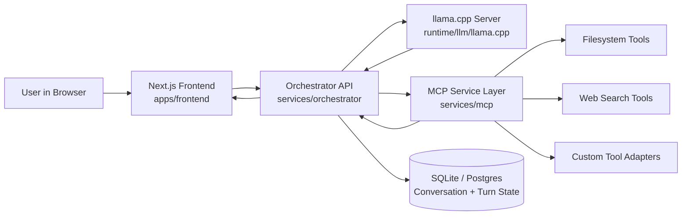

# Tarbar AI (Web Branch)

This branch is the production Web experience of Tarbar AI: a local-first agent platform that combines llama.cpp inference, an orchestrator API, MCP tool execution, and a Next.js chat UI.

## What This Project Is

Tarbar AI is an agentic runtime designed for private, local operation. It keeps model execution and tool calling on your machine while exposing a modern chat workflow through the browser.

Core goals:
- Local LLM inference through llama.cpp
- Structured agent orchestration with persistence and policy controls
- MCP-based tool integration for safe, explicit tool calls
- Single-command bootstrap for repeatable setup

## Web Branch Scope

This `web` branch is optimized for browser-first usage.

Primary entrypoint:
- `apps/frontend` (Next.js chat UI)

Runtime services:
- `runtime/llm/llama.cpp` (local model runtime)
- `services/orchestrator` (agent loop, policy, tool routing, persistence)
- `services/mcp` (MCP servers and tool adapters)

## Technology Stack

- Model runtime: llama.cpp
- Agent/backend: Python + FastAPI/Uvicorn (orchestrator)
- Tooling protocol: MCP (FastMCP-based service layer)
- Frontend: Next.js + Node.js
- Bootstrap/build: Bash/PowerShell + Python + CMake
- Persistence: SQLite local state by default (or PostgreSQL in containerized deployments)

## How It Works

At runtime, each user message flows through a deterministic pipeline:

1. Browser sends prompt to orchestrator API.
2. Orchestrator builds model context and policy constraints.
3. Orchestrator asks llama.cpp for next action/response.
4. If model emits tool calls, orchestrator routes those calls to MCP.
5. MCP executes tool(s), returns structured results.
6. Orchestrator feeds tool outputs back to model.
7. Final grounded answer is returned to browser.

## Web Architecture Diagram



## MCP and Tool Calls

Tool calling is explicit and audited by the orchestrator.

Operational behavior:
- Tool calls are emitted by the model as structured requests.
- Orchestrator validates and dispatches to MCP.
- MCP returns normalized outputs (data/errors/metadata).
- Orchestrator records turn + tool trace and continues reasoning.

This allows the model to stay grounded in real local operations instead of hallucinating external state.

## One-Command Install and Run

Linux/macOS (web mode):

```bash
curl -fsSL https://github.com/ToniBirat7/Agentic_AI/raw/web/scripts/web_up.sh | bash
```

Linux/macOS (full branch bootstrap):

```bash
curl -fsSL https://github.com/ToniBirat7/Agentic_AI/raw/web/scripts/local_up.sh | bash
```

Windows PowerShell (web mode):

```powershell
powershell -ExecutionPolicy Bypass -Command "iwr https://github.com/ToniBirat7/Agentic_AI/raw/web/scripts/web_up.ps1 -UseBasicParsing | iex"
```

## Local Development

From an existing clone on this branch:

```bash
make install
make web-up
```

Useful commands:
- `make local-up` for full pipeline bootstrap
- `make dev-up` / `make dev-down` for service lifecycle
- `make health` for service checks

## Runtime Ports (Default)

- Frontend: `http://127.0.0.1:3000`
- Orchestrator: `http://127.0.0.1:8001`
- llama.cpp API: `http://127.0.0.1:8000`

## Prerequisites

- Git
- Python 3.10+
- Node.js 20+
- npm
- CMake
- Optional CUDA toolchain (`nvidia-smi`, `nvcc`) for GPU acceleration

## Production Notes

- Bootstrap scripts support branch-aware install/update.
- Runtime state defaults to local persistent storage.
- Install pipeline includes post-start pruning and cache cleanup for lean deployment footprints.
- Keep model artifacts in `models/` locally; large binaries stay out of git.

## Branch Strategy

- `web` (this branch): browser-first workflow.
- `master`: CLI-first workflow.

If you need the terminal experience, use the `master` branch installer.
